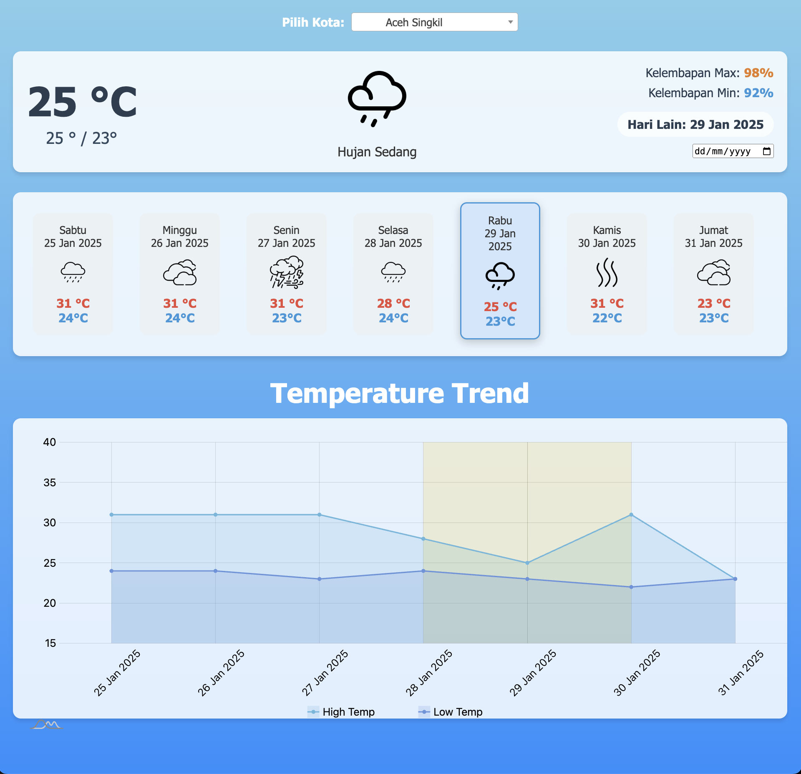

# Weather Forecast Dashboard

A simple Flask-based web application that displays weather forecasts for various cities in Indonesia. It retrieves data from a MySQL database and presents it in a user-friendly interface, complete with a dropdown city selector, current weather details, a 7-day forecast (Saturday to Friday), and an interactive temperature chart built with amCharts v5.

---

## Features

1. **City Selection**  
   - A dropdown (powered by [Select2](https://select2.org/)) that lets you pick any available city from the database.
   - The selection is stored in the URL query string, so reloading preserves your chosen city.

2. **Current Weather**  
   - Displays today’s forecast (if available).  
   - If today’s data is missing, it falls back to the first available day in the 7-day range.

3. **7-Day Forecast**  
   - Each day’s forecast is shown in a card with temperature range, weather condition icon, and humidity.
   - Missing data is marked with `N/A` and is not selectable.

4. **Interactive Chart**  
   - Uses [amCharts v5](https://www.amcharts.com/) to plot **high** and **low** temperatures over the 7-day period.  
   - Weather icons appear at the bottom of the chart.  
   - The chart highlights today’s date (plus one day before and after) if that data is present.

5. **API Endpoint**  
   - `/api/weather?city=<CITY_NAME>` returns JSON data with `current_weather` and `forecast` arrays—useful for integrating with other frontends or applications.

---

## Requirements

- Python 3.8+
- MySQL database access credentials

Below is a sample of the required Python libraries:

```text
Flask==2.2.5
Flask-SQLAlchemy==3.0.5
SQLAlchemy==2.0.19
PyMySQL==1.1.0
python-dotenv==1.0.0
```

> If you have a `requirements.txt` file, you can install everything by running:
> ```bash
> pip install -r requirements.txt
> ```

---

## Installation & Setup

1. **Clone or Download this Repository**  
   ```bash
   git clone https://github.com/your-username/your-repo.git
   cd your-repo
   ```

2. **Create and Activate a Virtual Environment (Optional but Recommended)**
   ```bash
   python -m venv venv
   source venv/bin/activate  # On Linux/Mac
   # or
   venv\Scripts\activate  # On Windows
   ```

3. **Install Dependencies**
   ```bash
   pip install -r requirements.txt
   ```

4. **Set up Environment Variables**
   - Create a `.env` file at the project root, or ensure environment variables are defined on your system.
   - The `.env` should at least define:
     ```bash
     DB_HOST=your-db-host
     DB_USERNAME=your-db-username
     DB_PASSWORD=your-db-password
     DB_NAME=your-db-name
     ```

5. **Database Table Structure**
   - Ensure you have a MySQL table or update `__tablename__` in the `Cuaca` model if it’s different).
   - The table schema should match the columns defined in the `Cuaca` model
---

## Usage

1. **Run the Application**
   ```bash
   python app.py
   ```
   or
   ```bash
   flask run
   ```
   Then open `http://127.0.0.1:5000` in your browser.

2. **Visit the Main Page (`/`)**
   - Select a city from the dropdown to load the 7-day forecast.
   - The chart at the bottom will automatically update.

3. **API Endpoint**
   - Use `/api/weather?city=<CITY_NAME>` to get JSON weather data.
   - Example:
     ```bash
     curl http://127.0.0.1:5000/api/weather?city=Bandung
     ```

---

## File Structure

```
your-repo/
│
├── app.py                  # Main Flask application
├── requirements.txt        # Dependencies
├── .env.example            # Example env file (create your own .env)
│
├── templates/
│   └── index.html          # Main HTML template using Jinja2
│
├── static/
│   ├── css/
│   │   └── style.css       # Custom CSS
│   ├── js/
│   │   └── app.js          # Frontend JavaScript (amCharts, city selection, forecast handling)
│   └── images/
│       ├── sunny.png
│       ├── cloudy.png
│       ├── rain.png
│       └── ... (weather icons)
└── README.md               # This file
```

---